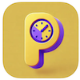
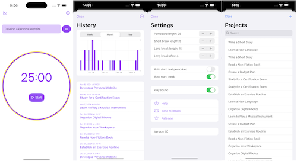

---
# Feel free to add content and custom Front Matter to this file.
# To modify the layout, see https://jekyllrb.com/docs/themes/#overriding-theme-defaults

title: Andrei Vlasov
layout: home 
---

# Andrei Vlasov
## iOS developer

[LinkedIn](https://www.linkedin.com/in/andreivlasov/)

[Github](https://github.com/fonbrot)

---
        
## Projects

### Productivno (2024)

[AppStore](https://apps.apple.com/rs/app/productivno/id6738010376)

[Github](https://github.com/fonbrot/productivno-app)

Boost your productivity with Productivno! Use the Pomodoro Technique to stay focused, track your progress with detailed statistics, and manage your projects efficiently.

---

### ReadSheet (2022)

[Github](https://github.com/fonbrot/readsheet-app)

ReadSheet helps to learn musical notes on the staff.

Train where each note falls on the staff and improve your reading sheet music skills. Practice recognizing the notes on the sheet and improve sight reading music. Memorize the position of the note and develop speed in reading sheet music. Repeat to identify music notes and see your progress by day

---

### Productivio (2018)

[Github](https://github.com/fonbrot/productivio)

Productivio is a power application for increasing personal productivity. Unique modern design and focus on task. 
Work for 25 minutes, then take a 5 minute break and repeat. It helps you focus by separating work time and rest time
Configure short and long focus sessions, breaks. Show statistic.

